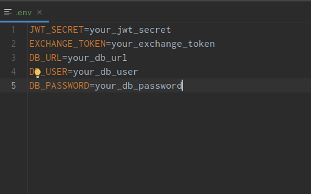

# Getting Started
1. Get you Exchange API token here https://exchangeratesapi.io/
2. Install Docker.
3. Go to the project folder.
4. Create .env file in the root folder and specify environment variables

5. Build the project by gradle task 'build'
   *gradle build -PTOKEN=your_exchange_service_token  -PSECRET=your_jwt_secret*
6. Run *docker-compose --env-file=.env up --build*
7. Open http://localhost:8082/api/categories.
8. Swagger http://localhost:8082/swagger-ui/index.html
